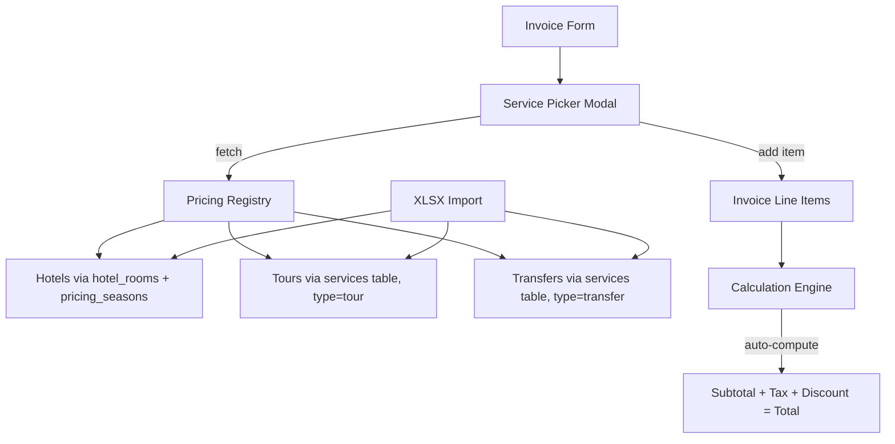

# Centralized Pricing System — Implementation Plan

## 1. Overview

This plan covers building a centralized pricing registry where **hotel, tour, and transfer prices** are managed in one place — either entered manually or imported via XLSX files. These registered prices can then be **selected and added to invoices** with an automatic calculation algorithm. Pricing fields are removed from voucher creation/edit forms (already partially done).

## 2. Current State Analysis

### What Already Exists

| Component | Status | Location |
|-----------|--------|----------|
| Hotel room pricing | Working | `hotel_rooms` table with single/double/triple/quad/child prices |
| Seasonal pricing | Working | `pricing_seasons` + `pricing_rates` tables, `SeasonalPricingController` |
| Board-type pricing | Working | `room_board_prices` table, API in `HotelProfileController` |
| Services catalog | Working | `services` table with type=tour/transfer/hotel, `ServiceController` |
| Hotel XLSX import | Working | `HotelProfileController::importXlsx()` with native ZipArchive parser |
| Invoice + line items | Working | `invoices` + `invoice_items` tables, `InvoiceController` |
| Voucher pricing removal | Partial | Prior work removed pricing from voucher create/edit forms |

### Key Gaps

1. **No XLSX import for tours or transfers** — only hotels have it
2. **No price lookup when building invoices** — prices are typed manually
3. **No link between services catalog and invoice line items** — `invoice_items.item_id` exists but is always 0
4. **Services table lacks adult/child/infant granularity for tours** — columns were added via migration but the form does not use them
5. **No calculation algorithm** — subtotal/tax/discount/total are manually entered on the invoice form
6. **Invoice form has no service picker** — no way to browse and select from the pricing catalog

## 3. Architecture



## 4. Implementation Steps

### Phase 1: Enhance the Services Pricing Catalog

**Goal**: Make the `services` table the single source of truth for tour and transfer pricing, with adult/child/infant support.

#### 1.1 Update services table schema

Add missing pricing columns if not present:

```sql
ALTER TABLE services 
  ADD COLUMN IF NOT EXISTS price_adult DECIMAL(10,2) DEFAULT 0,
  ADD COLUMN IF NOT EXISTS price_child DECIMAL(10,2) DEFAULT 0,
  ADD COLUMN IF NOT EXISTS price_infant DECIMAL(10,2) DEFAULT 0,
  ADD COLUMN IF NOT EXISTS destination VARCHAR(200) DEFAULT '',
  ADD COLUMN IF NOT EXISTS duration VARCHAR(100) DEFAULT '',
  ADD COLUMN IF NOT EXISTS vehicle_type VARCHAR(100) DEFAULT '',
  ADD COLUMN IF NOT EXISTS max_pax INT DEFAULT 0,
  ADD COLUMN IF NOT EXISTS pickup_location VARCHAR(255) DEFAULT '',
  ADD COLUMN IF NOT EXISTS dropoff_location VARCHAR(255) DEFAULT '';
```

**Files to modify**: New migration SQL file in `database/`

#### 1.2 Update the Services form

Extend `views/services/form.php` to show:
- Adult/child/infant pricing fields (conditionally shown for tour type)
- Transfer-specific fields: vehicle type, pickup/dropoff, max pax
- Tour-specific fields: destination, duration

**Files to modify**: `views/services/form.php`, `src/Controllers/ServiceController.php`

#### 1.3 Update the Services index/list

Show pricing breakdown columns (adult/child/infant) and service-type-specific details.

**Files to modify**: `views/services/index.php`

---

### Phase 2: XLSX Import for Tours and Transfers

**Goal**: Allow bulk import of tour and transfer pricing via XLSX, matching the pattern used for hotel imports.

#### 2.1 Create XLSX templates

Generate two new XLSX templates:
- **Tour pricing template**: Name, Description, Destination, Duration, Price Adult, Price Child, Price Infant, Currency, Unit, Status
- **Transfer pricing template**: Name, Description, Pickup, Dropoff, Vehicle Type, Max Pax, Price, Currency, Unit, Status

**Files to create**: 
- `templates/tour_import_template.xlsx` (generated via `templates/generate_tour_template.php`)
- `templates/transfer_import_template.xlsx` (generated via `templates/generate_transfer_template.php`)

#### 2.2 Add import endpoints to ServiceController

Reuse the same `parseXlsx()` approach from `HotelProfileController`. Add methods:
- `importTourXlsx()` — parse XLSX, upsert into `services` where `service_type = 'tour'`
- `importTransferXlsx()` — parse XLSX, upsert into `services` where `service_type = 'transfer'`

**Files to modify**: `src/Controllers/ServiceController.php`

#### 2.3 Add import UI to services index

Add an import button and modal to `views/services/index.php` with file upload, template download links, and import result feedback.

**Files to modify**: `views/services/index.php`

#### 2.4 Add routes

Register new routes for the import endpoints.

**Files to modify**: `src/Core/App.php` (or wherever routes are registered)

---

### Phase 3: Service Picker for Invoices

**Goal**: When creating/editing an invoice, users can search and select services from the pricing catalog and add them as line items.

#### 3.1 Create a pricing lookup API

New API endpoint that returns services filtered by type, with search:

```
GET /api/services/search?type=tour&q=bosphorus
GET /api/services/search?type=transfer&q=airport
GET /api/services/search?type=hotel&q=grand+star
```

Returns: `{id, name, description, service_type, price, price_adult, price_child, price_infant, currency, unit}`

For hotels, also provide a companion endpoint:
```
GET /api/hotels/room-pricing?hotel_id=X&check_in=YYYY-MM-DD&check_out=YYYY-MM-DD
```
This should check seasonal pricing and return applicable rates.

**Files to modify**: `src/Controllers/ServiceController.php` (add `searchApi()` method)

#### 3.2 Redesign the invoice form with line-item builder

Replace the current flat invoice form with a dynamic line-item builder using Alpine.js:

- **Partner/company selector** (keep existing autocomplete)
- **Add Line Item button** that opens a service picker modal
- **Service picker modal** with:
  - Type tabs: Hotel / Tour / Transfer / Other
  - Search box with debounced API calls
  - Results list showing service name, price, unit
  - Click to add as invoice line item
- **Line items table** showing:
  - Description (auto-filled from service, editable)
  - Quantity (editable)
  - Unit price (auto-filled from service catalog, editable for overrides)
  - Line total (auto-calculated: qty * unit_price)
  - Remove button
- **Totals section** (auto-calculated):
  - Subtotal (sum of line totals)
  - Tax rate % input -> tax amount auto-calculated
  - Discount input
  - Grand total = subtotal + tax - discount

**Files to modify**: `views/invoices/form.php` (major rewrite)

#### 3.3 Update invoice store/update logic

Modify `InvoiceController::store()` to:
1. Accept line items as arrays from POST
2. Save each line item to `invoice_items` with proper `item_type` and `item_id` linking back to the service
3. Auto-calculate totals server-side (never trust client math)

**Files to modify**: `src/Controllers/InvoiceController.php`, `src/Models/Invoice.php`

#### 3.4 Hotel-specific pricing integration

When adding a hotel service to an invoice:
1. User selects hotel from catalog
2. System checks if seasonal pricing applies for the given dates
3. If seasonal rate exists, uses that; otherwise falls back to base room price
4. Calculates: nights * room_rate * room_count

The calculation flow:
```
check_in, check_out -> compute nights
hotel_id + room_type + dates -> lookup pricing_seasons -> get rate
rate * nights * rooms = hotel line item total
```

**Files to modify**: `src/Controllers/SeasonalPricingController.php` (enhance `checkApi`)

---

### Phase 4: Calculation Algorithm

**Goal**: Implement a reusable pricing calculation engine.

#### 4.1 Create a PricingCalculator helper class

```php
class PricingCalculator {
    // Tour calculation
    static function calculateTour(
        float $priceAdult, float $priceChild, float $priceInfant,
        int $adults, int $children, int $infants
    ): float;
    
    // Hotel calculation  
    static function calculateHotel(
        float $roomRate, int $nights, int $rooms,
        ?float $seasonMultiplier = 1.0
    ): float;
    
    // Transfer calculation
    static function calculateTransfer(
        float $basePrice, string $unit, int $pax
    ): float;
    
    // Invoice totals
    static function calculateInvoiceTotals(
        array $lineItems, float $taxRate = 0, float $discount = 0
    ): array; // returns [subtotal, tax_amount, total]
}
```

**Files to create**: `src/Core/PricingCalculator.php`

#### 4.2 Integrate calculator into controllers

Use `PricingCalculator` in:
- `InvoiceController::store()` for server-side total validation
- `TourController::voucherStore()` if prices are still stored on tours
- `TransferController::store()` for transfer pricing
- Hotel invoice creation

**Files to modify**: `src/Controllers/InvoiceController.php`, `src/Controllers/TourController.php`, `src/Controllers/TransferController.php`

#### 4.3 JavaScript calculation mirror

Add client-side calculation in Alpine.js that mirrors `PricingCalculator` for real-time UI updates on the invoice form. The server always re-validates.

**Files to modify**: `views/invoices/form.php` (inline Alpine.js)

---

### Phase 5: Clean Up Voucher Forms

**Goal**: Complete the removal of pricing from voucher create/edit forms (partially done).

#### 5.1 Verify and clean create forms

Confirm pricing sections are fully removed from:
- `views/hotels/voucher.php` (hotel voucher create)
- `views/tours/form.php` (tour voucher create)
- `views/transfers/form.php` (transfer voucher create)

Remove any orphaned Alpine.js variables (price, currency, etc.) that are no longer bound to form fields.

**Files to audit**: `views/hotels/voucher.php`, `views/tours/form.php`, `views/transfers/form.php`

#### 5.2 Verify and clean edit forms

Same cleanup for:
- `views/hotels/voucher_edit.php`
- `views/tours/form_edit.php`
- `views/transfers/form_edit.php`

**Files to audit**: `views/hotels/voucher_edit.php`, `views/tours/form_edit.php`, `views/transfers/form_edit.php`

#### 5.3 Clean up controllers

Ensure `TourController::voucherStore()` and `TransferController::store()` still handle pricing columns gracefully (default to 0 or pull from services catalog).

**Files to modify**: `src/Controllers/TourController.php`, `src/Controllers/TransferController.php`

---

### Phase 6: Hotel-specific Invoice Form

**Goal**: Enhance the hotel and tour invoice forms to use the pricing catalog.

#### 6.1 Update hotel invoice form

Modify `views/hotels/invoice_form.php` to:
- Auto-populate pricing from hotel room catalog when hotel/room/dates are selected
- Apply seasonal multipliers automatically
- Show price breakdown: base rate, season adjustment, nights, total

**Files to modify**: `views/hotels/invoice_form.php`

#### 6.2 Update tour invoice form

Modify `views/tours/invoice_form.php` to:
- Lookup tour service pricing from catalog
- Show adult/child/infant breakdown
- Auto-calculate total

**Files to modify**: `views/tours/invoice_form.php`

#### 6.3 Update transfer invoice form

Modify `views/transfers/invoice_form.php` to:
- Lookup transfer pricing from catalog
- Show per-vehicle or per-person calculation

**Files to modify**: `views/transfers/invoice_form.php`

---

## 5. Database Changes Summary

### New Migration File: `database/migration_pricing_system.sql`

```sql
-- Enhance services table for detailed pricing
ALTER TABLE services 
  ADD COLUMN IF NOT EXISTS price_adult DECIMAL(10,2) DEFAULT 0,
  ADD COLUMN IF NOT EXISTS price_child DECIMAL(10,2) DEFAULT 0,
  ADD COLUMN IF NOT EXISTS price_infant DECIMAL(10,2) DEFAULT 0,
  ADD COLUMN IF NOT EXISTS destination VARCHAR(200) DEFAULT '',
  ADD COLUMN IF NOT EXISTS duration VARCHAR(100) DEFAULT '',
  ADD COLUMN IF NOT EXISTS vehicle_type VARCHAR(100) DEFAULT '',
  ADD COLUMN IF NOT EXISTS max_pax INT DEFAULT 0,
  ADD COLUMN IF NOT EXISTS pickup_location VARCHAR(255) DEFAULT '',
  ADD COLUMN IF NOT EXISTS dropoff_location VARCHAR(255) DEFAULT '';

-- Add service reference to invoice_items for traceability
ALTER TABLE invoice_items
  ADD COLUMN IF NOT EXISTS service_id INT UNSIGNED DEFAULT NULL,
  ADD COLUMN IF NOT EXISTS check_in DATE DEFAULT NULL,
  ADD COLUMN IF NOT EXISTS check_out DATE DEFAULT NULL,
  ADD COLUMN IF NOT EXISTS nights INT DEFAULT 0,
  ADD COLUMN IF NOT EXISTS adults INT DEFAULT 0,
  ADD COLUMN IF NOT EXISTS children INT DEFAULT 0,
  ADD COLUMN IF NOT EXISTS infants INT DEFAULT 0,
  ADD COLUMN IF NOT EXISTS unit_type VARCHAR(50) DEFAULT 'flat',
  ADD COLUMN IF NOT EXISTS base_price DECIMAL(10,2) DEFAULT 0,
  ADD COLUMN IF NOT EXISTS season_multiplier DECIMAL(5,2) DEFAULT 1.00;
```

## 6. New Files Summary

| File | Purpose |
|------|---------|
| `src/Core/PricingCalculator.php` | Calculation engine for all service types |
| `database/migration_pricing_system.sql` | Schema changes for enhanced pricing |
| `templates/generate_tour_template.php` | Generate tour XLSX import template |
| `templates/generate_transfer_template.php` | Generate transfer XLSX import template |
| `templates/tour_import_template.xlsx` | Tour pricing import template |
| `templates/transfer_import_template.xlsx` | Transfer pricing import template |

## 7. Modified Files Summary

| File | Changes |
|------|---------|
| `src/Controllers/ServiceController.php` | Add XLSX import, search API, adult/child/infant handling |
| `src/Controllers/InvoiceController.php` | Line-item based store/update, calculator integration |
| `src/Controllers/TourController.php` | Default pricing from catalog, clean up |
| `src/Controllers/TransferController.php` | Default pricing from catalog, clean up |
| `src/Models/Invoice.php` | Add line-item CRUD methods |
| `views/services/form.php` | Adult/child/infant fields, type-specific fields |
| `views/services/index.php` | Import UI, enhanced listing |
| `views/invoices/form.php` | Major rewrite: service picker, line-item builder, auto-calc |
| `views/hotels/invoice_form.php` | Seasonal price lookup integration |
| `views/tours/invoice_form.php` | Catalog price lookup |
| `views/transfers/invoice_form.php` | Catalog price lookup |
| `views/hotels/voucher.php` | Verify pricing removal |
| `views/tours/form.php` | Verify pricing removal, clean Alpine.js |
| `views/transfers/form.php` | Verify pricing removal |
| `views/hotels/voucher_edit.php` | Verify pricing removal |
| `views/tours/form_edit.php` | Verify pricing removal |
| `views/transfers/form_edit.php` | Verify pricing removal |
| `src/Core/App.php` | Register new routes |

## 8. Execution Order

The phases should be implemented in order since each builds on the previous:

1. **Phase 1** — Enhance services catalog (foundation for everything)
2. **Phase 2** — XLSX import (populate the catalog with data)
3. **Phase 4** — Calculation algorithm (needed before invoice integration)
4. **Phase 3** — Service picker + invoice form (depends on 1 + 4)
5. **Phase 5** — Clean up voucher forms (independent, can be done anytime)
6. **Phase 6** — Type-specific invoice forms (polish, depends on 3 + 4)

## 9. Risks and Considerations

- **Existing invoice data**: The current `invoice_items` rows have `item_id = 0`. Migration should not break existing records. New columns should all be nullable or have defaults.
- **Currency mismatch**: Services may be priced in different currencies. The invoice should enforce a single currency, or handle conversion. Start with single-currency enforcement per invoice.
- **Seasonal pricing complexity**: A hotel stay spanning two seasons needs per-night rate calculation. The `PricingCalculator` should handle date-range splitting.
- **XLSX parsing**: The existing `parseXlsx()` method in `HotelProfileController` should be extracted into a shared utility so `ServiceController` can reuse it without duplication.
- **Backward compatibility**: Tour and transfer voucher tables still have price columns. These should remain in the DB but default to 0 when created from the voucher form. Invoices pull pricing from the catalog instead.
